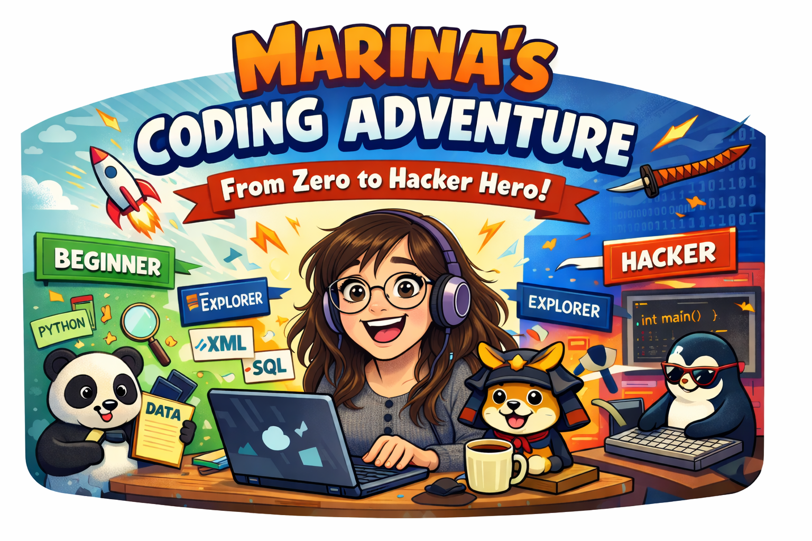

## Installation Instructions

These instructions will help you set up Python, JupyterLab, and all required packages **before the class**. This process takes about 10-15 minutes.

### Step 1: Clone the Repository

Open a terminal and navigate to where you want to store the course materials (for example, your home directory or a `Projects` folder):

```bash
# Navigate to your desired location
cd ~

# Clone the repository
git clone https://github.com/marinaMoji/codeclass.git

# Navigate into the repository
cd codeclass
```

### Step 2: Check Python Installation

Python 3 should already be installed on your system. Check if it's available:

```bash
python3 --version
```

You should see something like `Python 3.10.x` or higher. If you get an error, install Python:

```bash
# On Ubuntu/Debian
sudo apt update
sudo apt install python3 python3-venv
```

**Why we use `python3-venv`**: Modern Linux systems (Ubuntu 23.04+) have "externally managed" Python environments, which means you cannot install packages directly to the system Python. Using a virtual environment avoids this restriction and is the recommended approach.

### Step 3: Create a Virtual Environment

A virtual environment is an isolated Python environment for this project. This keeps your project's packages separate from system packages.

```bash
# Create a virtual environment in a folder called 'venv'
python3 -m venv venv

# Activate the virtual environment
source venv/bin/activate
```

**What happens**: After running `source venv/bin/activate`, you should see `(venv)` at the beginning of your terminal prompt. This means the virtual environment is active.

**Note**: You need to activate the virtual environment every time you open a new terminal. If you close the terminal, run `source venv/bin/activate` again when you reopen it.

### Step 4: Install Required Packages

With the virtual environment activated, install all required packages:

```bash
# Make sure you're in the codeclass directory and venv is activated
# (you should see (venv) in your prompt)

# Upgrade pip (the package installer) to the latest version
pip install --upgrade pip

# Install all required packages using the requirements file
pip install -r requirements.txt
```

This will install: `jupyterlab`, `ipykernel`, `pandas`, and `lxml`.

### Step 5: Register the Virtual Environment as a Jupyter Kernel

This tells JupyterLab to use the Python from your virtual environment:

```bash
# Make sure venv is still activated (you should see (venv) in your prompt)
python -m ipykernel install --user --name=codeclass --display-name "Python (codeclass)"
```

**What this does**: Creates a Jupyter kernel named "codeclass" that uses your virtual environment's Python and packages.

### Step 6: Verify Installation

Test that everything works:

```bash
# Check that packages are installed
python -c "import pandas; import lxml; print('All packages installed successfully!')"
```

If you see the success message, you're ready!

### Step 7: Launch JupyterLab

Start JupyterLab from the project directory:

```bash
# Make sure you're in the codeclass directory
cd ~/codeclass  # or wherever you cloned it

# Make sure venv is activated
source venv/bin/activate

# Launch JupyterLab
jupyter lab
```

**What happens**: 
- JupyterLab will start and open automatically in your web browser
- The URL will be something like `http://localhost:8888`
- You'll see the JupyterLab interface showing the files in the `codeclass` directory

### Step 8: Select the Correct Kernel in JupyterLab

When you open a notebook in JupyterLab:

1. Click on any `.ipynb` notebook file to open it
2. Look at the top-right corner of the notebook
3. You should see a kernel name (it might say "Python 3" or similar)
4. Click on it and select **"Python (codeclass)"** from the dropdown menu
5. The notebook will now use your virtual environment with all the installed packages

**Important**: You must select the "Python (codeclass)" kernel for each notebook you open, at least the first time. JupyterLab will remember your choice for that notebook.

### Quick Start Checklist (Day of Class)

On the day of class, you just need to:

```bash
# 1. Navigate to the repository
cd ~/codeclass

# 2. Activate the virtual environment
source venv/bin/activate

# 3. Start JupyterLab
jupyter lab
```

Then select "Python (codeclass)" as the kernel when opening notebooks.

## Additional Notes

- The notebooks use data from the `data/` directory. Make sure you don't delete or move this folder.
- All notebooks are designed to work with Python 3.8 or newer.
- If you encounter encoding errors with Japanese text, make sure your terminal/system supports UTF-8 encoding.
- **Deactivating the virtual environment**: When you're done, you can deactivate it with `deactivate` (you'll no longer see `(venv)` in your prompt). You can always reactivate it later with `source venv/bin/activate`.

## Course Schedule

This is a 10-hour schedule designed for a one-day intensive course (9:00-19:00). Time estimates are approximate and can be adjusted based on student pace.

Actually, AI told me it would take you 15 hours and be impossible to do all in one day, so this is also a test to see if Daniel can overestimate the limits of your intelligence and endurance.

| Time | Activity | Duration |
|------|----------|----------|
| 09:00-09:30 | Part 1: Intro + Numbers (quick) | 30 min |
| 09:30-11:30 | Part 1: Strings, Lists, Dicts, Functions | 120 min |
| 11:30-11:45 | Break | 15 min |
| 11:45-12:00 | Part 1: Files (quick), Regex basics | 15 min |
| 12:00-13:00 | Part 2: Pandas Intro, Loading, Exploring (quick), Filtering | 60 min |
| 13:00-14:00 | Lunch | 60 min |
| 14:00-15:00 | Part 2: Merging (thorough) | 60 min |
| 15:00-15:30 | Part 2: Statistics | 30 min |
| 15:30-15:45 | Break | 15 min |
| 15:45-17:30 | Part 3: XML parsing (Parts 5-7, skip 8-9) | 105 min |
| 17:30-18:30 | Part 4: Choose one project (4A or 4B) | 60 min |
| 18:30-19:00 | Wrap-up, Q&A, review | 30 min |

**Total: 10 hours** (9:00-19:00)

**Key Time-Savers:**
- Skip Part 1 Numbers notebook - do a 5-minute demo
- Skip Part 1 Regex - mention it, don't go deep
- Move quickly through Part 2 Exploring - show the basics
- Skip Part 3 Parts 1-4 - do a quick demo, then jump to parsing
- Skip Part 3 Part 8 (scaling up) - mention it, don't implement
- Choose one Part 4 project - don't try both
